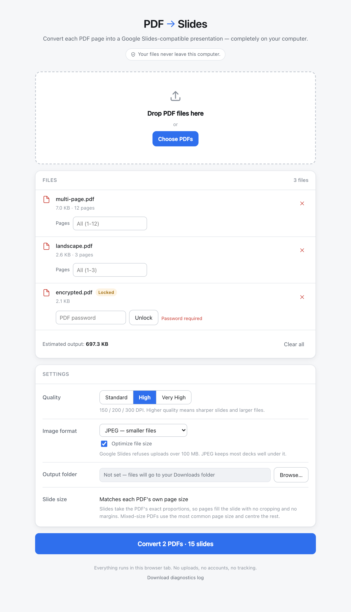
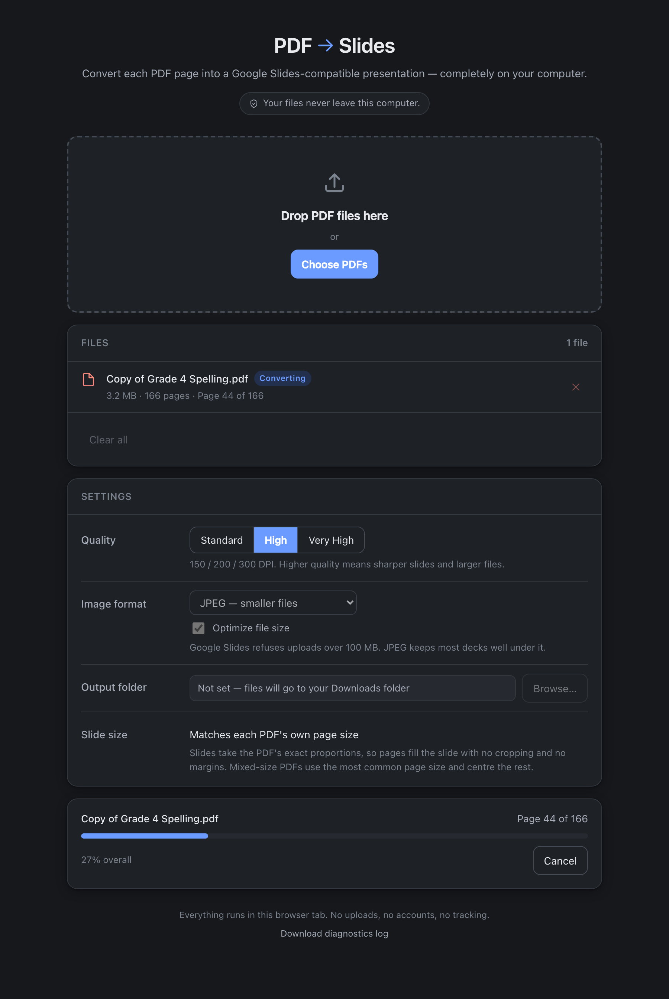
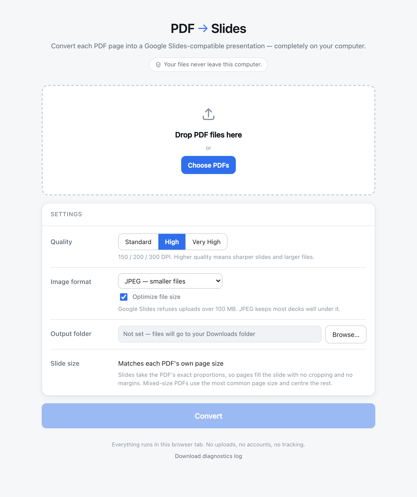

# PDF → Slides

Convert every page of a PDF into a slide of a `.pptx` you can upload to Google
Drive and open in Google Slides — entirely on your own computer.

The whole application is **one HTML file**. Double-click it, and it opens in
your browser. There is no installer, no Python, no server, and no account. Your
PDFs are read by JavaScript inside the page; nothing is uploaded anywhere.

```
dist/PDFtoSlides.html      ~4.7 MB, works offline, Windows and macOS alike
```

## Screenshots

| | |
|---|---|
|  |  |
| Three files queued — page ranges, a password prompt, a live size estimate | Converting, in dark mode, with per-page progress and Cancel |



## What it does

- Drag PDFs onto the page, or pick them with a file dialog. Several at once.
- Each PDF page is rendered to a high-resolution image and placed on its own
  slide, filling the slide edge to edge.
- One `.pptx` per PDF, named after the original file.
- Quality presets at 150 / 200 / 300 DPI, JPEG or lossless PNG.
- Page ranges per file — `1-10, 14, 20-25`.
- Password-protected PDFs prompt for the password.
- Live estimate of the output size, with a warning before you exceed Google
  Slides' 100 MB upload limit.
- Progress per page, a working Cancel button, and a downloadable diagnostics log.

### What it deliberately does not do

Text is **not** reconstructed as editable PowerPoint text. Each page becomes a
picture. That is the whole point: it is the only way to guarantee that fonts,
equations, diagrams, annotations and unusual layouts survive exactly as drawn.
A slide made this way cannot be edited in Google Slides beyond moving or
cropping the image.

There is no OCR, no vector reconstruction, no Google Drive integration, no
telemetry and no network access of any kind.

## How PDF pages are represented inside the .pptx

Each slide holds exactly one full-bleed picture and nothing else — no text
boxes, no placeholders, no speaker notes. The slide background is white.

**Slide size.** PowerPoint stores one slide size for the entire presentation,
while a PDF may vary its page size page by page. The strategy is:

1. Measure every page being converted, in PDF points (1/72 inch).
2. Group pages by size, rounded to the nearest half point, and take the
   **most common** size. Ties go to whichever appears first in the document.
3. Convert that to inches and use it as the slide size, so the typical page
   fills its slide exactly, with no margins and no cropping.
4. Clamp into PowerPoint's legal range of 1 to 56 inches per side, scaling both
   sides together so the aspect ratio never changes. A 5000 pt (69.4 in) page
   becomes 56 in; a 36 pt (0.5 in) page becomes 1 in.
5. Any page that is not the chosen size is scaled to fit **inside** the slide
   and centred, leaving white margins. Nothing is ever cropped and nothing is
   ever stretched out of proportion.

So a uniform A4 document produces 8.2677 × 11.6929 in slides with images at
x=0, y=0. A mixed document produces slides at its dominant size with the odd
pages centred.

## Architecture

```
src/
  core/           pure rules — no DOM, no PDF library, unit-tested in Node
    pageRanges.js     "1-10, 14" -> [1..10, 14]
    slideGeometry.js  page sizes -> slide size + per-page placement
    naming.js         output filenames, collisions, cross-platform sanitising
    sizeEstimate.js   output size projection and byte formatting
    quality.js        quality preset -> DPI -> render scale
    errors.js         PdfError and its error codes
  convert/        the conversion pipeline
    pdfjs.js          loads the inlined pdf.js, its fonts and CMaps
    pdfRenderer.js    open, measure, render one page to an image blob
    pptxBuilder.js    accumulate slides, emit the .pptx blob
    converter.js      orchestrates one file, reports progress, honours cancel
  ui/             everything that touches the DOM
    index.html        the page shell, with build-time placeholders
    styles.css        light/dark tokens, follows the system appearance
    app.js            queue state machine, settings, progress, results
    output.js         folder writing vs browser download
    store.js          settings in localStorage, folder handle in IndexedDB
    log.js            diagnostics log
    entry.js          browser entry point
build.mjs         inlines every asset into one self-contained HTML file
```

The layering rule: `core` knows nothing about the browser, `convert` knows
nothing about the interface, and `ui` is the only place with DOM access. That is
what makes `core` testable in plain Node and the rest testable in a browser.

**The single-file build.** `build.mjs` bundles the app's modules with esbuild,
then inlines pdf.js, its parser worker, PptxGenJS, 16 standard fonts and 168
CJK CMaps as JavaScript string globals, and injects them along with the
stylesheet into `src/ui/index.html`. The result loads from `file://` with no
network requests at all — which is also why libraries are inlined as strings
rather than fetched: a `file://` page has an opaque origin and cannot fetch
anything, not even itself.

## Running it

Just open `dist/PDFtoSlides.html`. That is the whole product.

For development:

```bash
npm install
node build.mjs           # writes dist/PDFtoSlides.html
node build.mjs --dev     # writes dist/dev.html with sourcemaps
open dist/PDFtoSlides.html          # macOS
start dist\PDFtoSlides.html         # Windows
```

There is no dev server and none is needed; the built file is the app.

## Tests

```bash
npm run test:unit    # pure logic, Node's built-in runner
npm run test:e2e     # drives the built file in headless Chromium
npm test             # both
```

The end-to-end suite converts real fixture PDFs and reopens the resulting
`.pptx` to check slide counts, slide dimensions and picture placement.

Fixtures live in `tests/fixtures/` and are committed. To regenerate them:

```bash
npm run fixtures     # needs uv; pulls pypdf and reportlab on demand
```

## Browser support

| | Chrome / Edge | Firefox | Safari |
|---|---|---|---|
| Conversion | yes | yes | yes |
| Choose an output folder | yes | no — downloads | no — downloads |

Choosing a folder uses the File System Access API, which only Chromium browsers
implement. Everywhere else the finished files arrive through the normal
download flow. Chrome asks once per batch for permission to save multiple files.

## Known limitations

- **The output is images, not text.** Nothing in the resulting deck is
  selectable or searchable. This is by design; see above.
- **File size.** A long, image-heavy PDF makes a large deck. A 121-page scanned
  document at 200 DPI produced 48 MB. Google Slides refuses uploads over
  100 MB, so the app estimates the size up front and offers to reduce quality.
- **No "open the output folder" button.** A web page cannot open Finder or
  Explorer. The folder name is shown instead.
- **Very large pages are scaled down.** Rendering is capped at 40 megapixels per
  page, and slides at 56 inches, both PowerPoint and memory limits.
- **A tab has finite memory.** Pages are rendered and released one at a time, so
  a several-hundred-page document works, but an enormous one may still exhaust
  a 32-bit browser process.
- **Non-embedded exotic fonts** fall back to the pdf.js standard font set. The
  16 standard PostScript fonts are embedded; anything else relies on the PDF
  embedding its own fonts, which almost all do.

## Privacy

No network requests, no analytics, no telemetry, no accounts, no cloud APIs.
The app functions with the machine offline. The only data that leaves the page
is the `.pptx` you asked it to save and, if you press the button, a diagnostics
log containing filenames and error text — never document contents.
